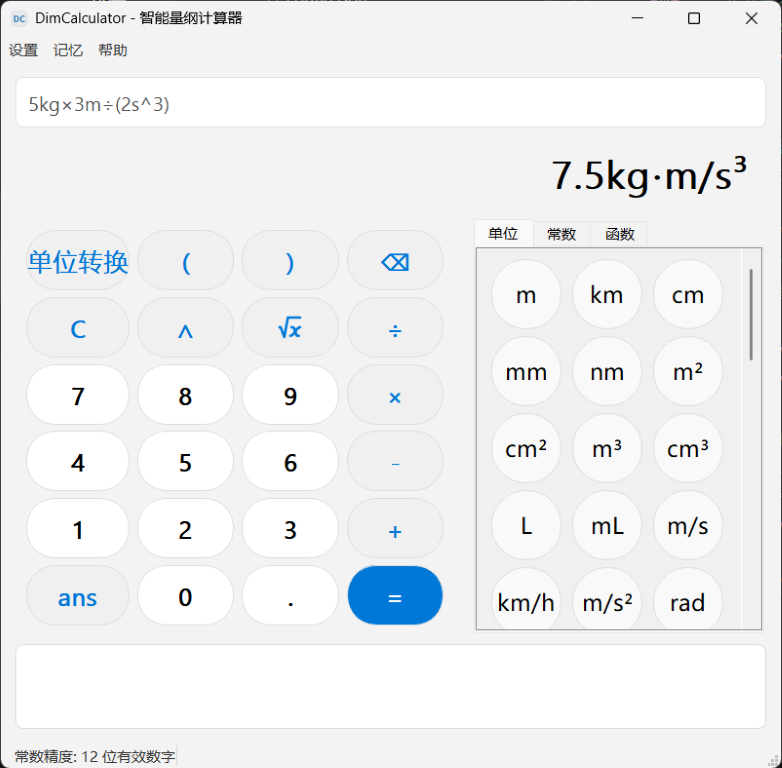
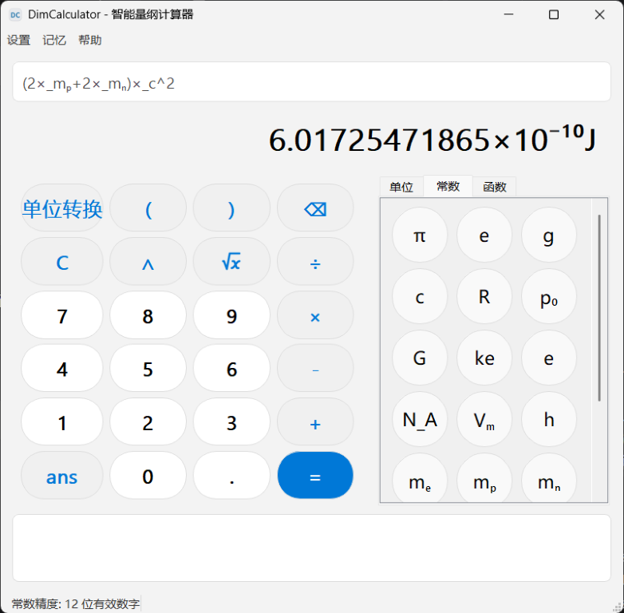
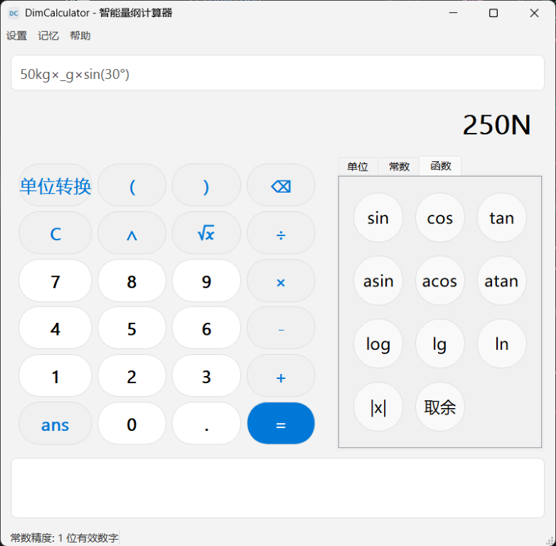
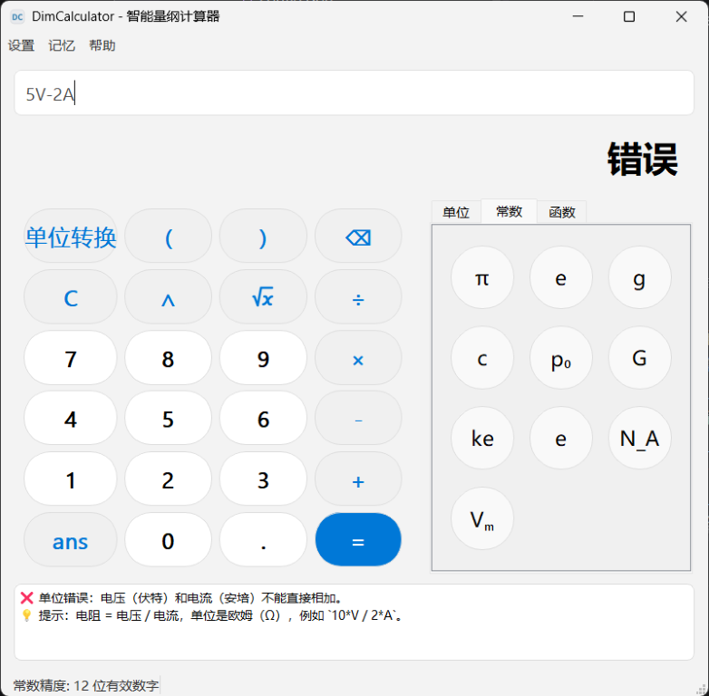
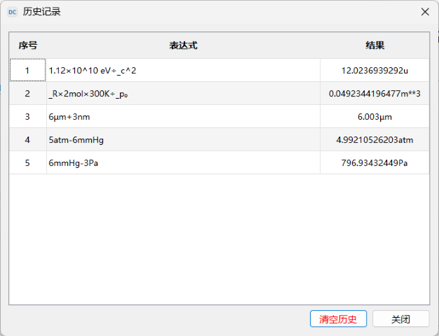
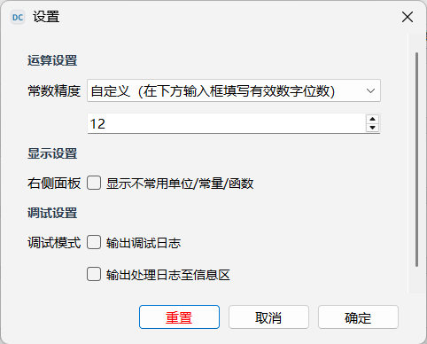

# DimCalculator - 智能量纲计算器

[]()
[](LICENSE)
[]()
[](https://github.com/ljx-13/DimCalculator/releases)

---

## 项目简介

**DimCalculator** 是一款为高中物理学习设计的智能量纲计算器。

在高中物理学习中，单位换算是很多同学的易错点。本软件支持直接输入带单位的表达式（如 `5m + 20cm`），自动进行单位换算和量纲检查，并给出清晰的计算结果。

本软件有助于帮助用户避免繁杂的单位换算，同时帮助用户养成带单位运算的习惯，培养量纲思维。

（本软件尚未经过完整测试，可能存在计算错误情况，若不放心可在设置中打开`输出处理日志至信息区`监控程序运行。若发现问题，可在`设置-反馈`界面提交反馈）

### 主要功能

(演示图片可能不代表最新界面，请以实际为准)

- **全鼠标操作**：仿 Windows 11 计算器界面，无需键盘即可完成所有操作
- **带单位运算**：支持 `5m+20cm` 等带单位输入，可自由组合单位，无需拘束于公式

- **物理常数库**：内置重力加速度`_g`、光速`_c`等常用物理常数

- **函数**：支持sin、cos、tan等常见数学函数，自动识别角度（deg）和弧度（rad）

- **智能错误诊断**：对单位不匹配的情况给出具体修改建议

- **历史记录**：自动保存计算历史，支持清空和复制

- **上一次结果引用**：使用 `ans` 引用上一次计算结果
- **自定义设置**：可自由设置常数精度、不常用项是否显示、输出调试日志等设置项


## 快速开始

### 发布页

- https://github.com/ljx-13/DimCalculator/releases
- https://gitee.com/ljx-13/dim-calculator/releases （国内推荐）

### 环境要求

- Windows 10 及以上
- Linux/macOS 可从源码运行，但未充分测试
- Android/IOS 暂不支持

### 从源码运行

部分开发中的功能可能尚未提供发行版，您可以从源码运行

```bash
# 环境要求: Python 3.12+

# 1. 克隆仓库
git clone https://github.com/ljx-13/DimCalculator.git
# 或 git clone https://gitee.com/ljx-13/dim-calculator.git
cd DimCalculator

# 2. 创建并激活虚拟环境（推荐）
python -m venv venv
venv\Scripts\activate          # Windows
# source venv/bin/activate     # Linux / macOS

# 3. 安装依赖
pip install -r requirements.txt

# 4. 运行主程序
python main.py

# 5. 如需运行测试
python tools/test.py

# 6. 如需打包为exe
pyinstaller DimCalculator.spec  # 在项目根目录运行
```

## 项目结构

```text
DimCalculator/
    ├── .gitignore
    ├── DimCalculator.spec  # pyinstaller配置文件
    ├── LICENSE
    ├── README.md
    ├── datas/  # 数据文件
    │   ├── config.json  # 配置文件
    │   ├── consts.json  # 常数
    │   ├── icon/
    │   │   ├── ...
    │   │   └── appicon-forge/  # 软件图标预设，可用AppIcon Forge编辑
    │   └── units.json  # 单位
    ├── docs/
    │   ├── help.md  # 帮助文档
    │   └── images/  # 演示图片
    ├── fixme_todo.txt  # 待修复bug及开发计划
    ├── main.py
    ├── requirements.txt
    ├── src/  # 源代码
    │   ├── __init__.py
    │   ├── core.py  # 计算引擎
    │   └── gui.py  # 桌面端界面
    ├── tools/
    │   ├── publish.py  # 更新版本打包发布（自用）
    │   ├── reset.py  # 重置设置
    │   ├── test.py  # 测试
    │   └── tree.py  # 获取项目结构
    └── ui/
        ├── pyuic.bat  # 编译命令
        ├── settings.ui  # 设置界面
        ├── settings_ui.py  # settings.ui编译结果
        └── style.qss  # 样式表
```

## 鸣谢

### 图标来源

根号：[Tabler Icons](https://tabler.io/icons) (MIT)

设置：[IconPark](https://iconpark.oceanengine.com/) (Apache 2.0)

应用图标制作：[AppIcon Forge](https://zhangyu1818.github.io/appicon-forge/)
